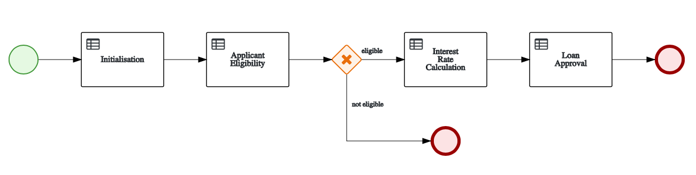

# Quick Loan Bank - Loan Pre-Approval Decision Service

This demo project showcases the different rule authoring tools used to define complex decision logic based on https://www.redhat.com/en/technologies/jboss-middleware/decision-manager.

The decision logic is then deployed and exposed as a decision service.

## Install and Run

Check full details about how to install and test this demo in this repo: https://github.com/jbossdemocentral/rhdm7-qlb-loan-demo/  

## Supporting videos 

### Import a Project

### Build, Deploy and Test using Swagger

