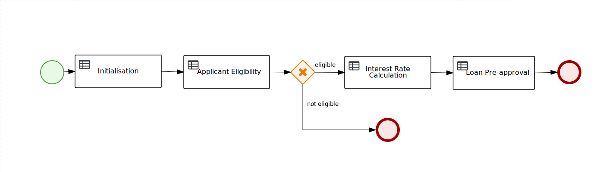

# Quick Loan Bank - Loan Application Decision Service

This demo project showcases the different rule authoring tools used to define complexe  decision logic based on [Red Hat Decision Manager 7.2](https://www.redhat.com/en/technologies/jboss-middleware/businessrules).

The decision logic is then deployed and exposed as a decision service.

## Prerequisites
In order to import and deploy this demo, you need to install [Red Hat Decision Manager 7.2](https://github.com/jbossdemocentral/rhdm7-install-demo).

## Supporting videos 

### Import a Project

### Build, Deploy and Test using Swagger
